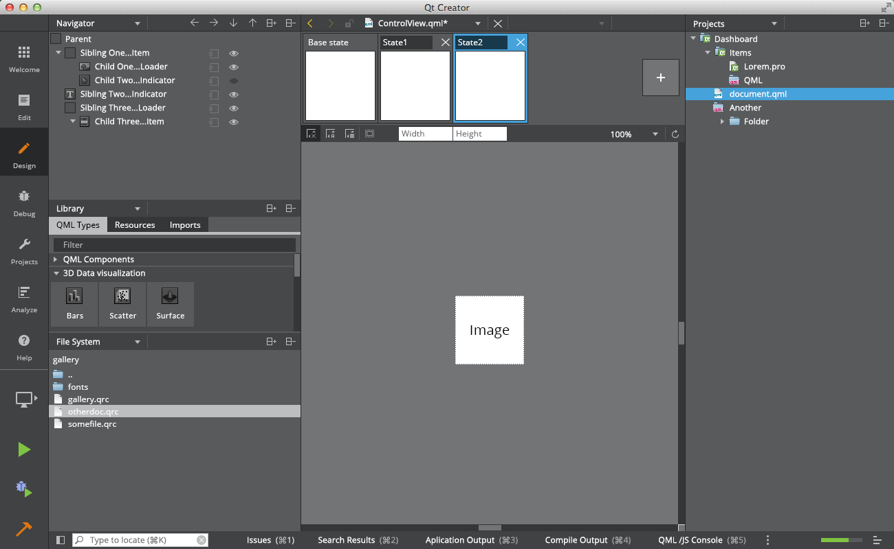
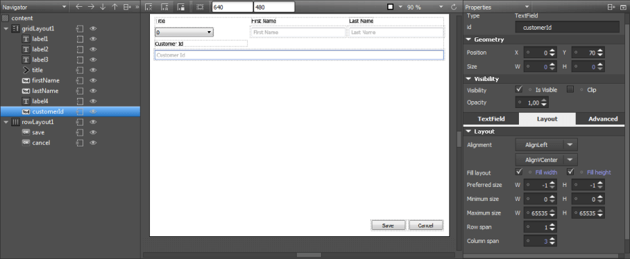

# **Introduction to Qt Creator**

**Qt Creator** is a powerful, cross-platform Integrated Development Environment (IDE) designed for creating applications with the **Qt Framework**. It provides developers with a suite of tools to design, develop, debug, and deploy applications across multiple platforms, including desktop, mobile, and embedded systems.

Qt Creator excels in enabling the development of **Graphical User Interfaces (GUIs)** using C++ and QML, making it suitable for modern, feature-rich applications.

---

## **Key Features for Creating a Great UI**

### 1. **Visual Design Mode**
- **Drag-and-Drop UI Editor**: Easily design UIs by dragging widgets or elements onto the canvas.
- **Qt Widgets Designer**: Ideal for creating traditional desktop-style interfaces with buttons, labels, and input fields.
- **Qt Quick Designer**: Specialized for creating responsive, modern UIs with QML, perfect for touch-based applications.

---

### 2. **Layouts for Responsive Design**
- **Flexible Layout Options**: Use Grid, Horizontal, and Vertical layouts to create responsive designs that adjust to different screen sizes.
- **Splitter Widgets**: Enable resizable panes for improved user experience.
- **Size Policies**: Control how widgets scale and behave when resized.

---

### 3. **Built-in Signal and Slot Mechanism**
- Seamlessly connect **UI interactions** (e.g., button clicks) to application logic.
- Use Qt's **signals and slots** system to handle dynamic user actions without complex coding.

---

### 4. **Integrated Resource Management**
- Manage resources like images, fonts, and icons in a unified `.qrc` file system.
- Ensure consistent and efficient access to assets throughout your application.

---

### 5. **Styling and Themes**
- **Qt Stylesheets**: Customize the appearance of widgets using CSS-like styling.
- **Custom Themes**: Build branded and visually appealing applications with built-in or user-defined themes.

---

### 6. **Real-Time UI Preview**
- Preview your design in real-time to check its appearance and functionality on various devices and screen resolutions.

---

### 7. **Localization and Multilingual Support**
- Integrate multiple language options into your UI for global accessibility.
- Use Qt's translation tools to adapt text-based components based on locale settings.

---

### 8. **Animation and Effects**
- Utilize QML to implement animations, transitions, and interactive effects.
- Add hover states, dynamic behaviors, and smooth transitions to enhance user experience.

---

### 9. **Custom Widgets**
- Extend functionality by creating and integrating custom widgets.
- Use third-party widget libraries to add advanced features to your UI.

---

### 10. **Accessibility Features**
- Add support for screen readers and keyboard navigation to make your application accessible to a broader audience.

---

### 11. **Code Integration**
- Switch seamlessly between **Design Mode** and **Code Editor** to fine-tune UI logic.
- Use auto-complete and syntax highlighting in both QML and C++ for easier customization.

---

## **Tips for Achieving a High-Quality UI with Qt Creator**
1. **Plan the Layout**: Use responsive layouts to ensure consistency across devices.
2. **Optimize Performance**: Leverage QML for animations and Qt Widgets for robust desktop applications.
3. **Prioritize Usability**: Design intuitive interfaces with logical grouping of components.
4. **Test on Multiple Platforms**: Utilize real-time previews and test on target devices for quality assurance.
5. **Leverage Documentation**: Refer to Qt's comprehensive documentation and examples for guidance and best practices.
