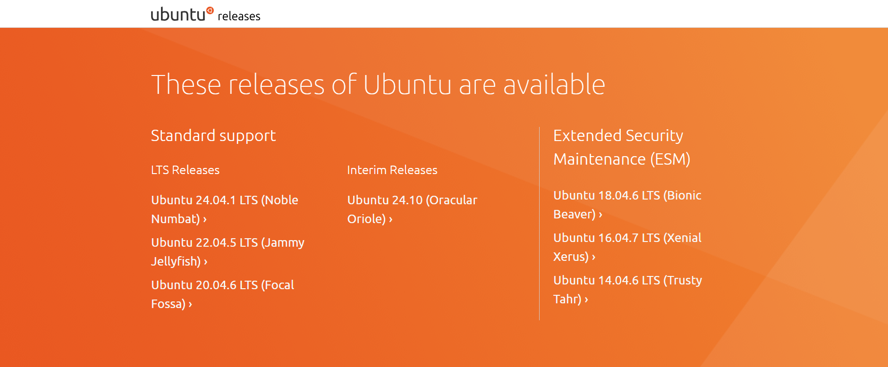
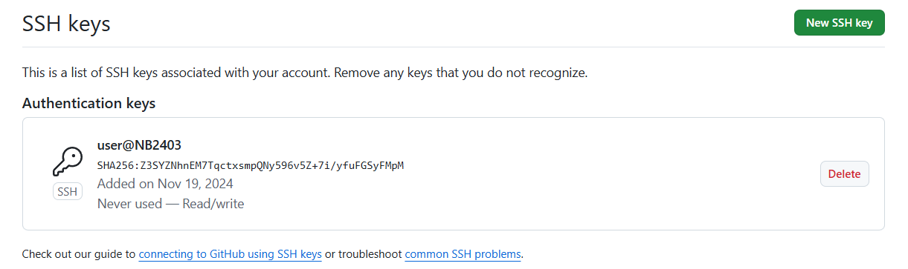
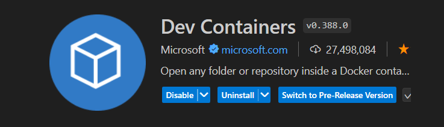
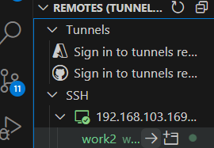

# 1.1 Setting Up Ubuntu, Docker, and Docusaurus

This guide provides a detailed walkthrough for setting up an Ubuntu environment, containerization with Docker, and running a Docusaurus project using Visual Studio Code.

---

## Steps

### 1. Installation of Ubuntu Image and Flashing to External PC

**Download Ubuntu ISO**:
   - Visit the [Ubuntu website](https://ubuntu.com/download) to download the appropriate ISO file for your system.

**Flash the ISO to a USB Drive**:
   - Use tools like balenaEtcher to flash the Ubuntu ISO to a bootable USB drive. 

**Install Ubuntu on the External PC**:
   - Boot the external PC from the USB drive.
   - Follow the on-screen instructions to install Ubuntu. Configure network settings during installation.

---

### 2. Installation of Docker for Containerization
**Update System Packages**:
   ```bash
   sudo apt update
   sudo apt upgrade -y
```
---
### 3. Installation of OpenSSH for Remote Control

1. **Install OpenSSH Server and Client:**

```bash
sudo apt install -y openssh-server openssh-client
```
**Start and Enable the SSH Service:**

```bash
sudo systemctl start ssh
sudo systemctl enable ssh
```
**Verify SSH Service:**

```bash
sudo systemctl status ssh
```

**Obtain the IP Address (For remote access):**

```bash
ip a
```
**Connect Remotely via SSH (From a different machine):**

```bash
ssh username@<ip_address>
```

---
### 4. Installation of Git and Connection with GitHub

**Install Git:**

```bash
sudo apt install -y git
```
**Configure Git:**

```bash
git config --global user.name "Your Name"
git config --global user.email "your.email@example.com"
```
**Generate an SSH Key:**

```bash
ssh-keygen -t rsa -b 4096 -C "your.email@example.com"
```
**Add the SSH Key to GitHub:**
- Copy the public key:
```bash
cat ~/.ssh/id_rsa.pub
```

- Add the key to your GitHub account under Settings > SSH and GPG keys.    

**Clone a Repository:**
```bash
git clone git@github.com:<username>/<repository>.git
```
---
### 5. Using Dev Containers in VS Code to Remote Control the Ubuntu System

**Install the Dev Containers Extension:**

- In VS Code, search for **Dev Containers** in the extensions marketplace and install it.



**Connect to the Ubuntu System via SSH:**
- Open the Remote Explorer in VS Code.
- Use the SSH connection to connect to the Ubuntu system.


**Create a Dev Container Configuration:**
- Add a .devcontainer folder to your project.
- Inside the folder, create a devcontainer.json file with appropriate configurations.

**Reopen the Folder in the Container:**
- Use the **Remote - Containers** extension to open your project inside the container.

### 6. Running Docusaurus on VS Code

**Install Node.js:**

```bash
sudo apt install -y nodejs npm
```
**Install Docusaurus:**
- Create a new Docusaurus project:
```bash
npx create-docusaurus@latest my-website classic
cd my-website
```
**Open the Project in VS Code:**
- Use the File > Open Folder option to open the Docusaurus project directory.

**Install Dependencies:**

```bash
npm install
```
**Start the Development Server:**

```bash
npx docusaurus start
```
**Access Your Docusaurus Site:**
- Open the provided URL (e.g., http:/ /localhost:3000) in your browser to view the site.
---

# Summary of Commands
```bash
## Ubuntu Update
sudo apt update && sudo apt upgrade -y

## Install Docker
sudo apt install -y docker.io
sudo systemctl enable docker
sudo systemctl start docker

## Install OpenSSH
sudo apt install -y openssh-server openssh-client
sudo systemctl start ssh
sudo systemctl enable ssh

## Install Git
sudo apt install -y git
git config --global user.name "Your Name"
git config --global user.email "your.email@example.com"

## Install Node.js
sudo apt install -y nodejs npm

## Create Docusaurus Project
npx create-docusaurus@latest my-website classic
cd my-website
npm install
npx docusaurus start
```