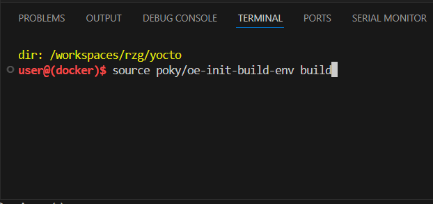
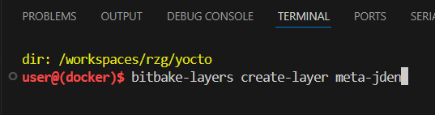
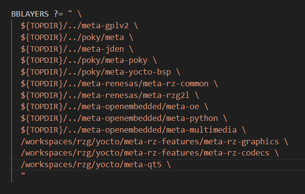
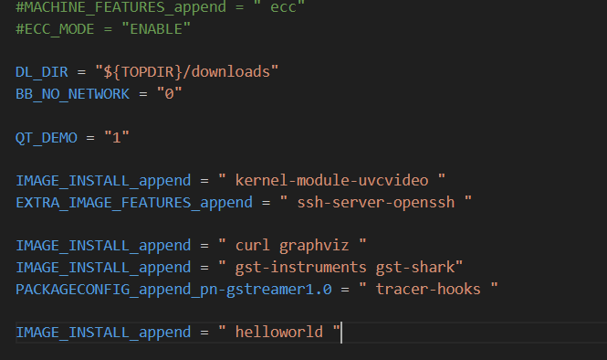
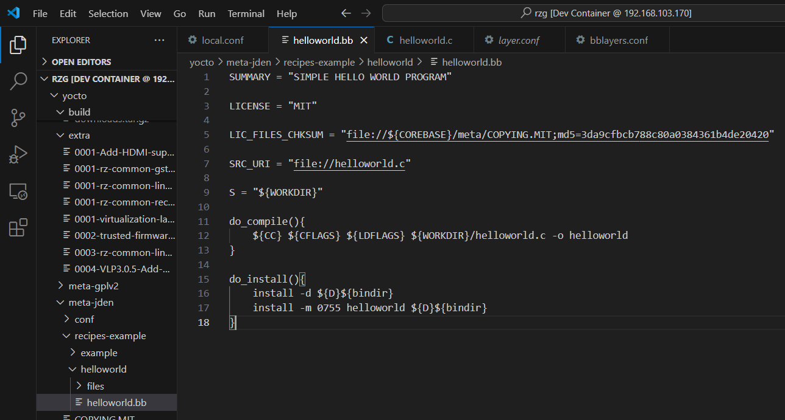
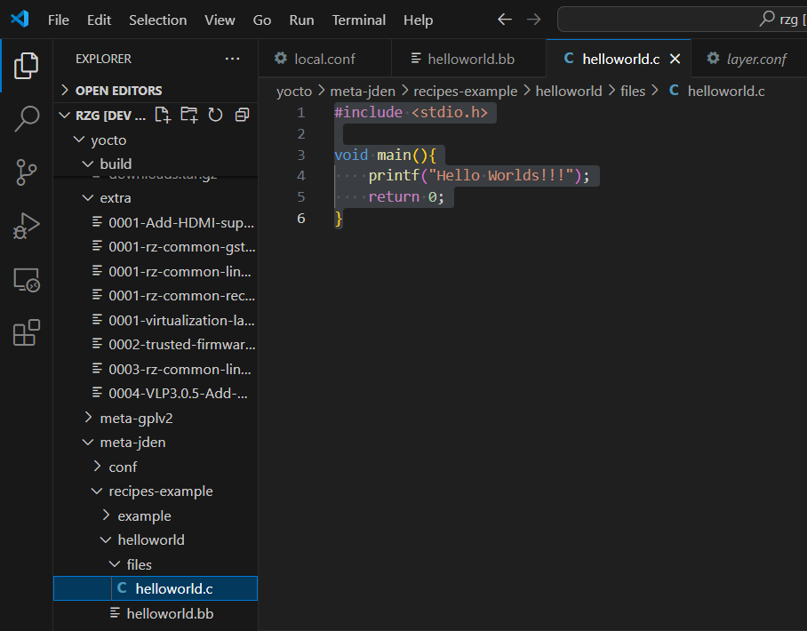
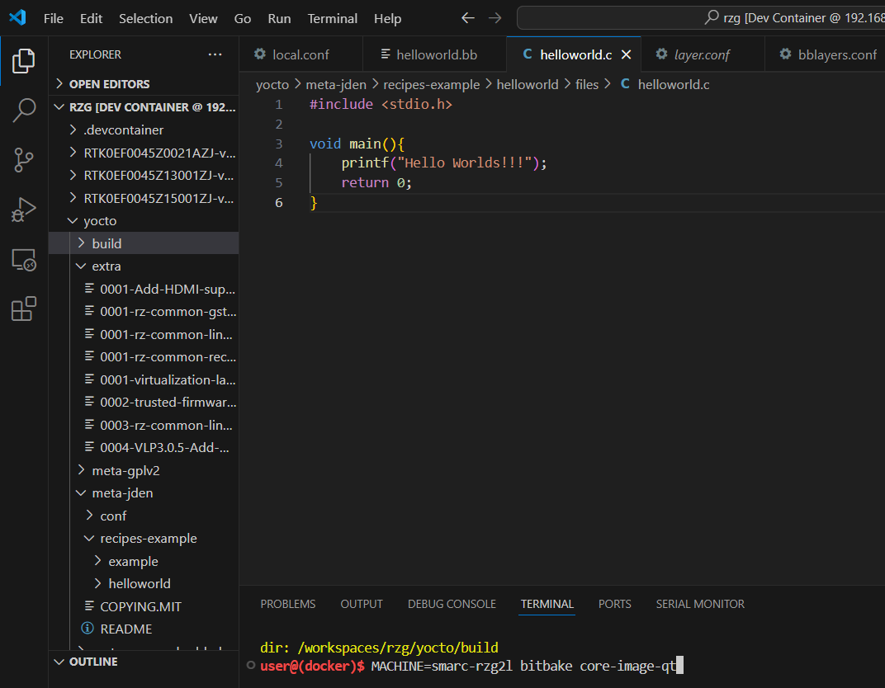
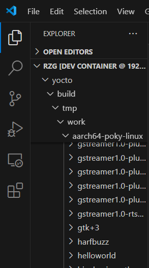
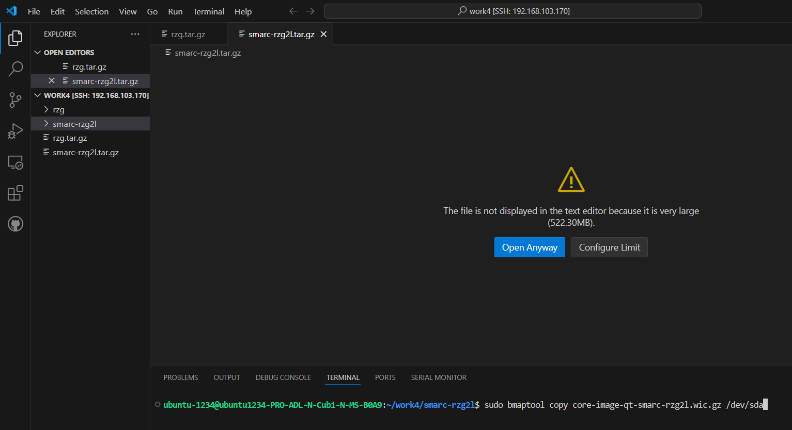
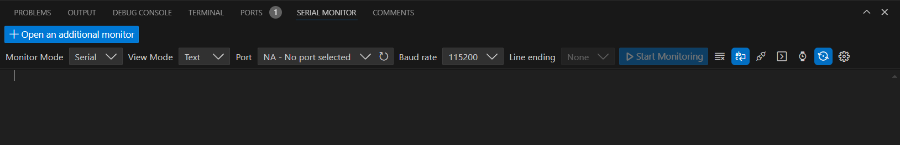

# 2.2 Prompting a "Hello World" Program on the RZG2L Board Using Yocto Project

## Overview
This tutorial demonstrates building and running a "Hello World" program on the RZG2L board by creating a custom Yocto Project layer and integrating a simple C program. The process involves creating a new layer, writing a recipe, adding a C source file, building the image, and deploying it to the board.

---

## Step-by-Step Instructions

### 1. Initialize the Yocto Project Build Environment
```bash
source poky/oe-init-build-env build
```  


**Explanation:**  
This initializes the Yocto Project build environment, setting up necessary environment variables and directories (`build/`), making it ready for further commands.

---

### 2. Create a Custom Layer
```bash
bitbake-layers create-layer meta-jden
```  


**Explanation:**  
A custom layer (`meta-jden`) is created to contain your custom recipes. Layers in Yocto provide modularity, allowing you to organize and add features to the build.

---

### 3. Add the Custom Layer to the Build Configuration
- Open `bblayers.conf` and add the following line:
  ```bash
  ${TOPDIR}/../meta-jden \
  ```
  

**Explanation:**  
Adding the layer to `bblayers.conf` ensures the build system recognizes and includes this layer during the build process.

---

### 4. Modify Local Configuration to Include the Program
- Open `local.conf` and append the following line:
  ```bash
  IMAGE_INSTALL_append = " helloworld "
  ```
  

**Explanation:**  
This directive ensures the `helloworld` program will be included in the final image. The `IMAGE_INSTALL_append` adds the program to the list of packages to be installed in the image.

---

### 5. Write the Recipe for the Hello World Program
- Create a folder `helloworld` inside `recipes-examples` and add a file `helloworld.bb` with the following content:
```plaintext
SUMMARY = "SIMPLE HELLO WORLD PROGRAM"

LICENSE = "MIT"
LIC_FILES_CHKSUM = "file://${COREBASE}/meta/COPYING.MIT;md5=3da9cfbcb788c80a0384361b4de20420"

SRC_URI = "file://helloworld.c"

S = "${WORKDIR}"

do_compile(){
    ${CC} ${CFLAGS} ${LDFLAGS} ${WORKDIR}/helloworld.c -o helloworld
}

do_install(){
    install -d ${D}${bindir}
    install -m 0755 helloworld ${D}${bindir}
}
```

 

**Explanation:**  
- `SUMMARY` provides a brief description of the recipe.  
- `LICENSE` declares the licensing terms.  
- `SRC_URI` specifies the source code location (in this case, `helloworld.c`).  
- `do_compile` is a build task using the provided toolchain to compile `helloworld.c` into an executable.  
- `do_install` copies the compiled binary to the appropriate system directory (`${bindir}`), making it accessible in the target image.

---

### 6. Add the Source Code
- Inside the `helloworld` folder, create a `files` directory. Add the following `helloworld.c` file:
```c
#include <stdio.h>

void main(){
    printf("Hello Worlds!!!");
    return 0;
}
```
 

**Explanation:**  
This simple C program prints "Hello Worlds!!!" to the standard output.

---

### 7. Build the Image
```bash
MACHINE=smarc-rzg2l bitbake core-image-qt
```  


**Explanation:**  
- `MACHINE=smarc-rzg2l` specifies the target machine configuration.  
- `bitbake` is the build tool to create the image, which will include the `helloworld` program.  
- `core-image-qt` is the image recipe used as the base.

---

### 8. Verify Build Success
- Check for the build output:
  ```bash
  /workspaces/rzg/yocto/build/tmp/work/aarch64-poky-linux/helloworld
  ```
  

**Explanation:**  
If the folder exists and contains the compiled binary, the build process was successful.

---

### 9. Deploy the Image to an SD Card
- Use the following command:
  ```bash
  sudo bmaptool copy <wic image>.wic.gz /dev/sda
  ```
  

**Explanation:**  
This writes the generated image to an SD card (`/dev/sda`), which will be used to boot the RZG2L board.

---

### 10. Setup and Boot the RZG2L Board
- Insert the SD card, connect the board, and power it on.

---

### 11. Monitor the Serial Output
- Open the serial monitor in VS Code:
  - Set the baud rate to `115200`.
  - Start monitoring.
 
 
---

By following these steps, you successfully build and execute a "Hello World" program on the RZG2L board, demonstrating a basic workflow in the Yocto Project for embedded systems development.
